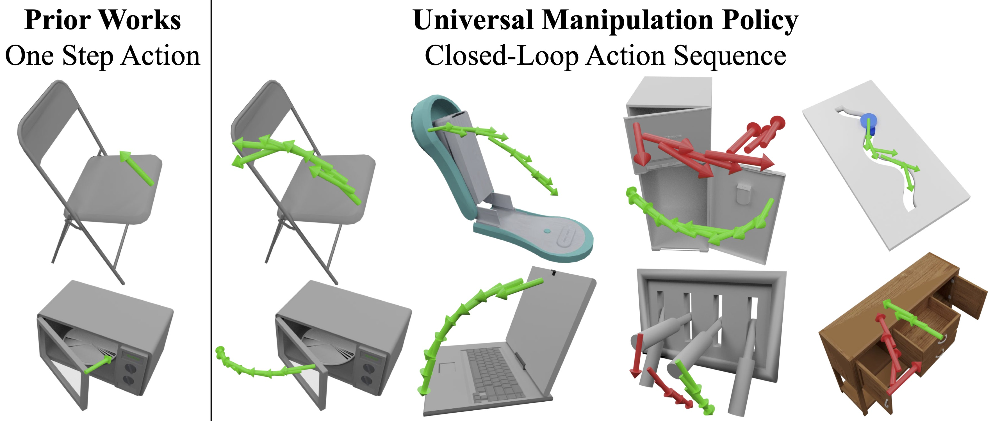
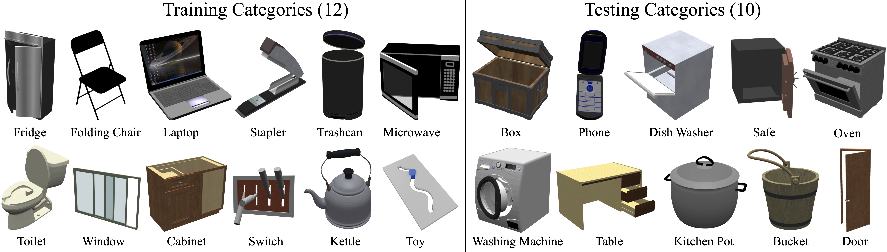

# UMPNet: Universal Manipulation Policy Network for Articulated Objects


[Zhenjia Xu](http://www.zhenjiaxu.com/),
[Zhanpeng He](https://zhanpenghe.github.io/),
[Shuran Song](https://www.cs.columbia.edu/~shurans/)
<br>
Columbia University
<br>
Robotics and Automation Letters (RA-L) / ICRA 2022

### [Project Page](https://ump-net.cs.columbia.edu/) | [Video](https://youtu.be/KqlvcL9RqKM) | [arXiv](https://arxiv.org/abs/2109.05668)

## Overview
This repo contains the PyTorch implementation for paper "UMPNet: Universal Manipulation Policy Network for Articulated Objects".


## Content

- [Prerequisites](#prerequisites)
- [Data Preparation](#data-preparation)
- [Testing](#testing)
- [Training](#training)

## Prerequisites

We have prepared a conda YAML file which contains all the python dependencies.
```sh
conda env create -f environment.yml
```

## Data Preparation

Prepare object URDF and pretrained model.
- [mobility_dataset](https://ump-net.cs.columbia.edu/download/mobility_dataset.zip): URDF of 12 training and 10 testing object categories.
- [pretrained](https://ump-net.cs.columbia.edu/download/pretrained.zip): pretrained model.

Download, unzip, and organize as follows:
```
/umpnet
    /mobility_dataset
    /pretrained
    ...
```

## Testing

### Test with GUI

There are also two modes of testing: exploration and manipulation.
```sh
# Open-ended state exploration
python test_gui.py --mode exploration --category CATEGORY

# Goal conditioned manipulation
python test_gui.py --mode manipulation --category CATEGORY
```
Here `CATEGORY` can be chosen from:
- training categories]: Refrigerator, FoldingChair, Laptop, Stapler, TrashCan, Microwave, Toilet, Window, StorageFurniture, Switch, Kettle, Toy
- [Testing categories]: Box, Phone, Dishwasher, Safe, Oven, WashingMachine, Table, KitchenPot, Bucket, Door


### Quantitative Evaluation
There are also two modes of testing: exploration and manipulation.
```sh
# Open-ended state exploration
python test_quantitative.py --mode exploration

# Goal conditioned manipulation
python test_quantitative.py --mode manipulation
```
By default, it will run quantitative evaluation for each category. You can modify pool_list(L91) to run evaluation for a specific category.

## Training
Hyper-parameters mentioned in paper are provided in default arguments.
```sh
python train.py --exp EXP_NAME
```
Then a directory will be created at `exp/EXP_NAME`, in which checkpoints, visualization, and replay buffer will be stored.

## BibTeX
```
@article{xu2022umpnet,
  title={UMPNet: Universal manipulation policy network for articulated objects},
  author={Xu, Zhenjia and Zhanpeng, He and Song, Shuran},
  journal={IEEE Robotics and Automation Letters},
  year={2022},
  publisher={IEEE}
}
```

## License

This repository is released under the MIT license. See [LICENSE](LICENSE) for additional details.

## Acknowledgement

- The code for [spherical sampling](spherical_sampling.py) is modified from [area-beamforming](https://github.com/marc1701/area-beamforming).
- The code for [UNet](unet_parts.py) is modified from [Pytorch-UNet](https://github.com/milesial/Pytorch-UNet).
